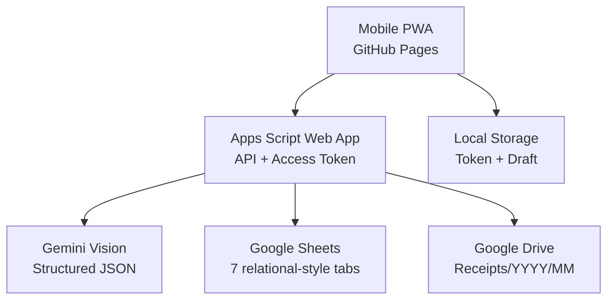

# Architecture — Version 1

## Frontend

- Vanilla HTML/CSS/JS ใน `frontend/`
- Mobile-first, กล้องหลัง, Gallery, Preview, Rotate, client-side resize
- Review Form ก่อนบันทึก, Manual entry, History/Edit, Dashboard
- Service Worker cache เฉพาะ App Shell; OCR/Save ต้องออนไลน์
- Access Token เก็บในอุปกรณ์ผู้ใช้ ไม่มี Gemini Key หรือ Google Secret
- POST `text/plain` เพื่อหลีกเลี่ยง CORS preflight กับ Apps Script

## Backend

- Release เดียว `apps-script/Code.gs` เพื่อให้วางใน Apps Script ได้โดยไม่สร้างหลายไฟล์
- Router, standardized response, logs, Sheet repository, Drive storage, Gemini, validation, duplicate, sales, buyers, dashboard
- Apps Script `LockService` ป้องกัน create ชนกัน
- `idempotencyKey` ป้องกันกดบันทึกซ้ำจากเครือข่ายมือถือ
- Update ใช้ `expectedUpdatedAt`; Void ไม่ลบ Sales row

## Security

- Gemini API Key อยู่ใน Script Properties เท่านั้น
- `setupV1()` สร้าง Access Token หนึ่งครั้งและเก็บเฉพาะ SHA-256 hash
- `health` เปิด public ได้และคืนเฉพาะ boolean/status
- Drive images ไม่ถูกตั้งเป็น public; URL เปิดได้ตามสิทธิ์บัญชี Google
- Logs ไม่บันทึก Key, Token หรือ base64 image

## Data

- Sales, Deductions, Buyers, OCRRuns, AuditTrail, Logs, Settings
- น้ำหนักเป็นกิโลกรัม เงินเป็นบาท วันที่ภายในใช้ `YYYY-MM-DD`, Timezone `Asia/Bangkok`
- Dashboard คำนวณเฉพาะ Sales ที่ไม่ใช่ `VOID`
- Buyer ถูกสร้างอัตโนมัติจากชื่อ+สาขาที่ normalized

## OCR pipeline

1. Browser ย่อ/หมุนรูปและสร้าง SHA-256
2. Backend ตรวจ MIME/ขนาด
3. Gemini รับ prompt ภาษาไทย + JSON Schema และต้องคืน null เมื่ออ่านไม่ได้
4. Backend normalize, validate และเขียน OCRRuns
5. PWA highlight confidence ต่ำและให้ผู้ใช้ตรวจแก้
6. Create ตรวจ duplicate อีกครั้ง เก็บรูป แล้วบันทึกข้อมูลแบบ transaction-like

## Duplicate score

- Image SHA ตรงกัน = 1.00
- Receipt number 0.35, date 0.20, buyer 0.15, weight 0.15, amount 0.15
- Warning เริ่มค่า Settings `DUPLICATE_WARN_SCORE`; Block เริ่ม `DUPLICATE_BLOCK_SCORE`

## Deployment

- Backend: Apps Script Execute as owner / Access Anyone
- Frontend: GitHub Actions → GitHub Pages
- PWA URL: `https://aodxx.github.io/Pem/`
