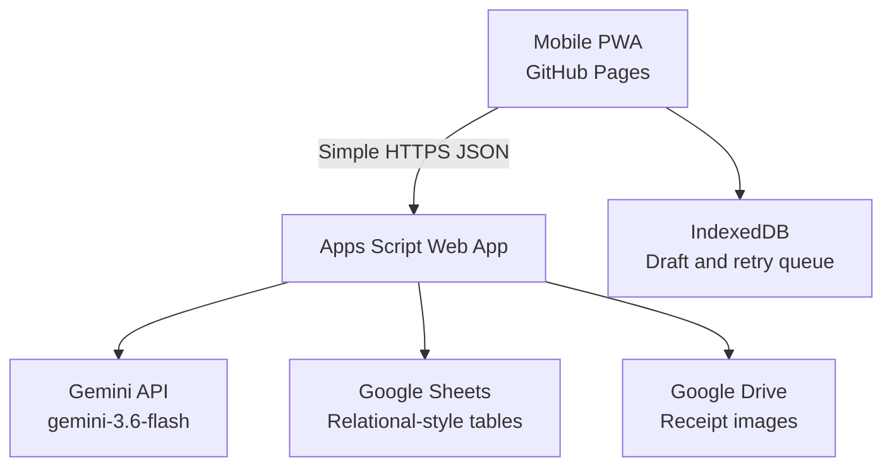

# Architecture

อัปเดตล่าสุด: 2026-08-12  
สถานะ: Phase 0 baseline

## เป้าหมายสถาปัตยกรรม

ระบบต้องใช้งานจริงบนมือถือ บันทึกใบชั่งหนึ่งใบได้เร็ว รักษา API Key ไว้ฝั่ง Backend และสามารถขยายจากการบันทึกรายได้ไปสู่ต้นทุน/แปลง/กำไรในอนาคต

## ภาพรวม

## ส่วนประกอบ

### 1. Frontend

- GitHub Pages
- Vanilla JavaScript แบบ ES Modules
- Mobile-first PWA
- ไม่มี Secret หรือ Gemini API Key
- รับกล้องด้วย `input[type=file][capture=environment]` เป็น baseline
- ใช้ `getUserMedia` เฉพาะโหมดกล้องขั้นสูงที่ Browser รองรับ
- ปรับ orientation, preview และสร้างสำเนาสำหรับ AI ใน Browser
- เก็บ Draft ที่ยังไม่บันทึกใน IndexedDB
- สื่อสารกับ Apps Script ด้วย Simple Request เพื่อหลีกเลี่ยง CORS preflight:
  - `Content-Type: text/plain;charset=utf-8`
  - ไม่ใช้ custom header
  - session token อยู่ใน JSON body/query ไม่อยู่ใน Repository

### 2. Apps Script Web App

แบ่งโค้ดเป็นชั้น:

- Router: แปลง `action` ไปยัง handler
- Auth: pairing/session validation
- Controllers: validate request/response
- Services: sale, OCR, duplicate, dashboard, image
- Repositories: อ่าน/เขียน Sheet แบบ batch
- Integrations: Gemini และ Drive
- Utilities: ID, dates, hashing, error envelope, logging

Deployment:

- Execute as owner
- Timezone `Asia/Bangkok`
- Secret เก็บใน Script Properties
- API ตอบ envelope เดียวกันทุก action
- ใช้ LockService ตอนสร้าง/แก้ไขรายการเพื่อป้องกันการเขียนชนกัน

### 3. Gemini

- Primary model: `gemini-3.6-flash` รุ่น Stable
- Model name อยู่ใน Settings/Script Properties เพื่อเปลี่ยนได้โดยไม่แก้ Frontend
- ส่งภาพพร้อมคำสั่งภาษาไทยและ JSON Schema
- ใช้ Structured Output
- Stateless request และไม่ใช้ผลลัพธ์ AI เป็นข้อมูลจริงจนผ่าน server validation
- ค่าที่อ่านไม่ได้เป็น `null`
- เก็บ model, latency, usage metadata และ schema version ใน OCRRuns
- Provider adapter ต้องทำให้สลับ Interactions API/generateContent ได้หาก endpoint หรือบัญชีมีข้อจำกัด โดยไม่กระทบ domain model

### 4. Google Sheets

ใช้ Sheet เป็นตารางแบบสัมพันธ์กันด้วย ID:

- Sales
- Deductions
- Buyers
- OCRRuns
- AuditTrail
- Settings
- Logs

การอ่านจำนวนมากใช้ `getValues()` ครั้งเดียวแล้ว map ใน memory ไม่อ่านทีละ cell

### 5. Google Drive

- โฟลเดอร์เฉพาะของระบบ
- โครงสร้าง `receipts/YYYY/MM/`
- ชื่อไฟล์ `PALM_<YYYYMMDD>_<receipt-or-unknown>_<saleId>.<ext>`
- เก็บ Drive File ID ใน Sales
- ไฟล์ไม่แชร์ Public
- Backend สร้างลิงก์สำหรับบัญชีเจ้าของหรือส่งภาพผ่าน action ที่ผ่าน session
- เก็บ SHA-256 และขนาดไฟล์เพื่อช่วยตรวจซ้ำ

## Security แบบ Personal App

ไม่ใช้ระบบสมาชิกซับซ้อน แต่ไม่ฝัง Secret ใน GitHub Pages:

1. ผู้ใช้สร้าง Pairing Code จาก Apps Script function ที่รันใน Editor
2. ใส่ Pairing Code ในหน้า Settings ของ PWA ครั้งเดียว
3. Backend ตรวจ code และออก session token อายุจำกัด
4. PWA เก็บ session token ใน IndexedDB/localStorage ของเครื่อง
5. Backend เก็บ hash ของ session ไม่เก็บ token ดิบ
6. ทุก write/action ส่วนตัวต้องผ่าน session
7. `health` เปิดสาธารณะได้ แต่ไม่คืนข้อมูลส่วนตัว

Pairing Code, Gemini API Key, Spreadsheet ID และ Drive Folder ID อยู่ใน Script Properties เท่านั้น

## Image pipeline

1. รับภาพต้นฉบับจากกล้องหรือ Gallery
2. ตรวจ MIME, ขนาด, orientation และ dimensions
3. แสดง preview/หมุน/crop
4. สร้าง AI copy ขนาดเหมาะสมและ contrast ดีขึ้น
5. ส่ง AI copy ไปวิเคราะห์
6. แสดง Review Form
7. เมื่อยืนยัน ส่งข้อมูลและต้นฉบับ
8. Backend ตรวจ duplicate
9. บันทึกรูป Drive ก่อน แล้วบันทึก Sales/Deductions แบบ transaction-like
10. ถ้าเขียน Sheet ล้มเหลว ให้ลบ/ทำเครื่องหมาย orphan image และบันทึก Log

## Data integrity

- ใช้ `schemaVersion` ในข้อมูล OCR และ API
- ใช้ ISO 8601 ภายในระบบ; UI แสดงไทย
- วันใน Sheet เป็น Date จริงหรือ ISO ที่มีรูปแบบเดียวกัน
- เงินเก็บเป็น Number หน่วยบาท ไม่เก็บสตริงมี comma
- น้ำหนักเก็บเป็น Number หน่วยกิโลกรัม
- การแก้ไขสร้าง AuditTrail ก่อน/หลัง
- Dashboard คำนวณจาก Sales ที่ `RecordStatus=ACTIVE`

## Duplicate detection

สร้างคะแนนจาก:

- receiptNumber ตรงกัน
- saleDate ตรงกัน
- buyer normalized ตรงกัน
- net/payable weight ใกล้กัน
- amount ใกล้กัน
- image SHA-256 ตรงกัน

ผลลัพธ์:

- 0.90–1.00: BLOCK จนผู้ใช้เลือก override
- 0.70–0.89: WARNING
- ต่ำกว่า 0.70: บันทึกตามปกติ

การ override ต้องเก็บ `DuplicateOverride=true`, รายการอ้างอิง และเหตุผล

## Observability

Logs ต้องมี:

- requestId
- action
- durationMs
- status/errorCode
- saleId
- OCR model/schema version
- ห้ามบันทึก API Key, pairing code, session token หรือภาพ base64

## ข้อจำกัดที่รับรู้

- Apps Script มี execution quota และไม่เหมาะกับ concurrent load สูง แต่เพียงพอสำหรับ Personal App
- การส่งภาพ base64 เพิ่มขนาดประมาณ 33%; Frontend ต้องจำกัดและบีบอัดสำเนา AI
- GitHub Pages เป็นคนละ origin กับ Apps Script จึงต้องหลีกเลี่ยง request ที่ทำให้เกิด preflight
- Offline Phase แรกเก็บ Draft ได้ แต่การวิเคราะห์และบันทึกต้องมี Internet
